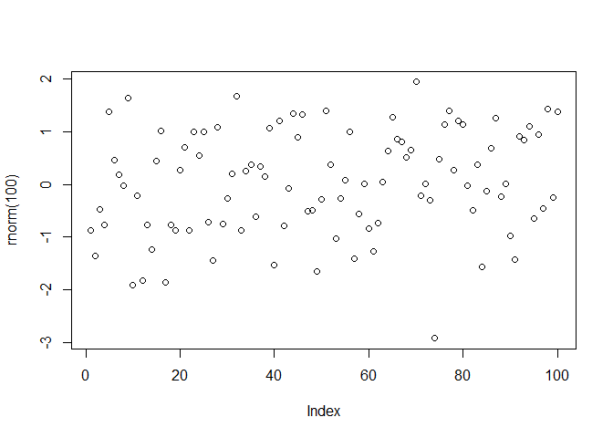
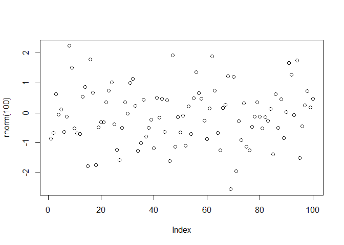
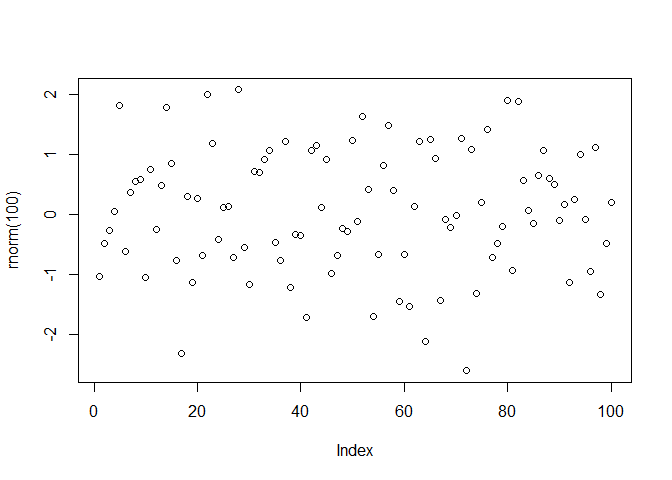
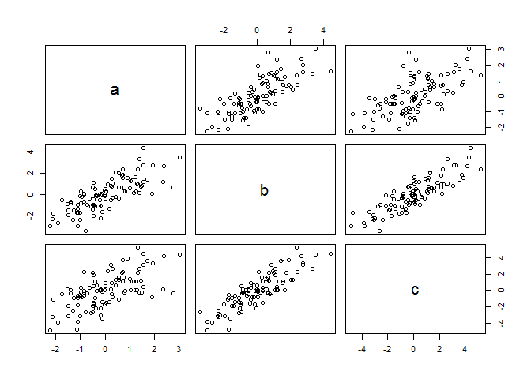
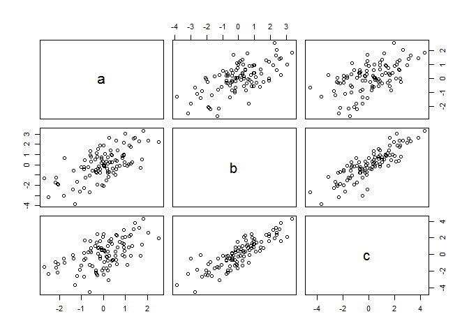

#### TODO \#1

``` r
((2014-2014)/(2014-1991))*100
```

    ## [1] 0

#### TODO \#2

``` r
startDiff = 2014 - 2014
birthDiff = 2014 - 1991

decPer = startDiff/birthDiff

per = decPer * 100 
per
```

    ## [1] 0

#### TODO \#3

``` r
nums = c(4,5,8,11)
sum(nums)
```

    ## [1] 28

#### TODO \#4

<!-- -->

#### TODO \#5

``` r
help (sqrt)
```

Exert from sqrt Help:

Description

abs(x) computes the absolute value of x, sqrt(x) computes the (principal) square root of x, square root of {x}

#### TODO \#6

``` r
for(i in 1:4){
  source("src/firstScript.R")
}
```

<!-- --><!-- --><!-- --><!-- -->

#### TODO \#7

``` r
P = seq(from=31, to=60, by=1)
Q = matrix(data=P, ncol=5)
P
```

    ##  [1] 31 32 33 34 35 36 37 38 39 40 41 42 43 44 45 46 47 48 49 50 51 52 53
    ## [24] 54 55 56 57 58 59 60

``` r
Q
```

    ##      [,1] [,2] [,3] [,4] [,5]
    ## [1,]   31   37   43   49   55
    ## [2,]   32   38   44   50   56
    ## [3,]   33   39   45   51   57
    ## [4,]   34   40   46   52   58
    ## [5,]   35   41   47   53   59
    ## [6,]   36   42   48   54   60

#### TODO \#8

``` r
source("src/secondScript.R")
```

<!-- -->

#### TODO \#9

``` r
source("src/secondScriptV2.R")
```

<!-- --><!-- -->

-   rgb is a function that sets colour based on RGB values and transparency based on alpha

-   lwd is the line width, default value of 1 if not specified

-   pch a integer or character that draws a sequence of points at the specified coordinates

-   cex number value that specifies the magnification (size) or elements like text or symbols

#### TODO \#10

``` r
data = read.table(file="src/tst1.txt", header=TRUE)
newData = data$g*5
write.table(newData, file="src/tst2.txt", row.names=FALSE)
read.table(file="src/tst2.txt")
```

    ##    V1
    ## 1   x
    ## 2  10
    ## 3  20
    ## 4  40
    ## 5  80
    ## 6 160
    ## 7 320

#### TODO \#11

``` r
vec = c(rnorm(100))
mean(sqrt(vec))
```

    ## Warning in sqrt(vec): NaNs produced

    ## [1] NaN

-   NaN's produced because the square root of a negative integer is an imaginary number,which for the purpose of this demonstration and simplicity does not exist.

#### TODO \#12

``` r
dates = strptime(c("20160123", "20161225", "20161206"), format="%Y%m%d")
pres = c(1,8,10)
plot(dates,pres, xlab="Dates", ylab="Expected Presents")
```

<!-- -->

#### TODO \#13

``` r
loopVec = seq(1:100)
newVec = c()
for(i in loopVec){
  if(i<5 || i>90){
    newVec[i]=loopVec[i]*10
  }else{
    newVec[i]=loopVec[i]*0.1
  }
}
print(newVec)
```

    ##   [1]   10.0   20.0   30.0   40.0    0.5    0.6    0.7    0.8    0.9    1.0
    ##  [11]    1.1    1.2    1.3    1.4    1.5    1.6    1.7    1.8    1.9    2.0
    ##  [21]    2.1    2.2    2.3    2.4    2.5    2.6    2.7    2.8    2.9    3.0
    ##  [31]    3.1    3.2    3.3    3.4    3.5    3.6    3.7    3.8    3.9    4.0
    ##  [41]    4.1    4.2    4.3    4.4    4.5    4.6    4.7    4.8    4.9    5.0
    ##  [51]    5.1    5.2    5.3    5.4    5.5    5.6    5.7    5.8    5.9    6.0
    ##  [61]    6.1    6.2    6.3    6.4    6.5    6.6    6.7    6.8    6.9    7.0
    ##  [71]    7.1    7.2    7.3    7.4    7.5    7.6    7.7    7.8    7.9    8.0
    ##  [81]    8.1    8.2    8.3    8.4    8.5    8.6    8.7    8.8    8.9    9.0
    ##  [91]  910.0  920.0  930.0  940.0  950.0  960.0  970.0  980.0  990.0 1000.0

#### TODO \#14

``` r
func1 = function(arg1){
  resVec = c()
  for(i in 1:length(arg1)){
    if(i<5 || i>90){
      resVec[i]=arg1[i]*10
    }else{
      resVec[i]=arg1[i]*0.1
    }
  }
  return(resVec)
}

vec14a = c(0,1,2,3,5,10,25,30,99,150)
func1(vec14a)
```

    ##  [1]  0.0 10.0 20.0 30.0  0.5  1.0  2.5  3.0  9.9 15.0

#### TODO \#15/Footnote challenge

-   The following code displays the time it takes to execute a vector computation versus the time it takes a for-loop to perform the same work

``` r
vect1 = c(-2,-3,-1,0,1,2,3,5,5,7,10,25,30,50,70,80,99,101,110,150,200)

func2 = function(arg1){
  result <- ifelse(arg1 < 5 | arg1 > 90, arg1 * 10, arg1 * 0.1)
  return(result)
}
vect2 = func2(vect1)
```

-   Time take using vector computation, non-loop

``` r
system.time(replicate(10000, func2(vect1)))
```

    ##    user  system elapsed 
    ##    0.12    0.00    0.12

-   Time take using for-loop

``` r
vec15a = c(0,1,2,3,5,10,25,30,99,150)
system.time(replicate(10000, func1(vec15a)))
```

    ##    user  system elapsed 
    ##    0.17    0.00    0.17

### Sources:

<https://cran.r-project.org/doc/contrib/Torfs+Brauer-Short-R-Intro.pdf>

<http://kbroman.org/knitr_knutshell/pages/markdown.html>

<https://www.rstudio.com/wp-content/uploads/2015/02/rmarkdown-cheatsheet.pdf>

<http://www.r-bloggers.com/using-apply-sapply-lapply-in-r/>

<https://www.rstudio.com/>

<https://cran.r-project.org/>

<https://github.com/swirldev/swirl>

<http://stackoverflow.com/questions/tagged/r>
